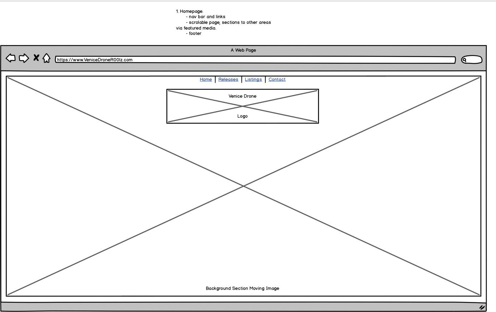
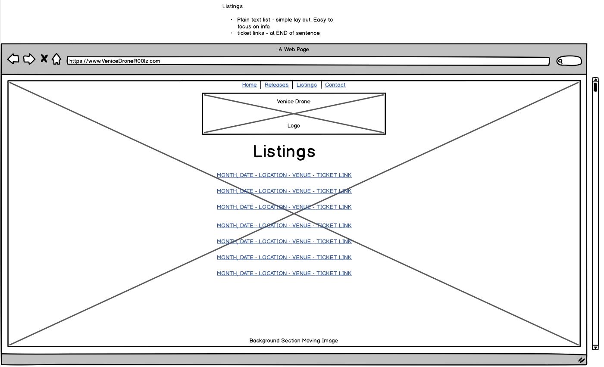
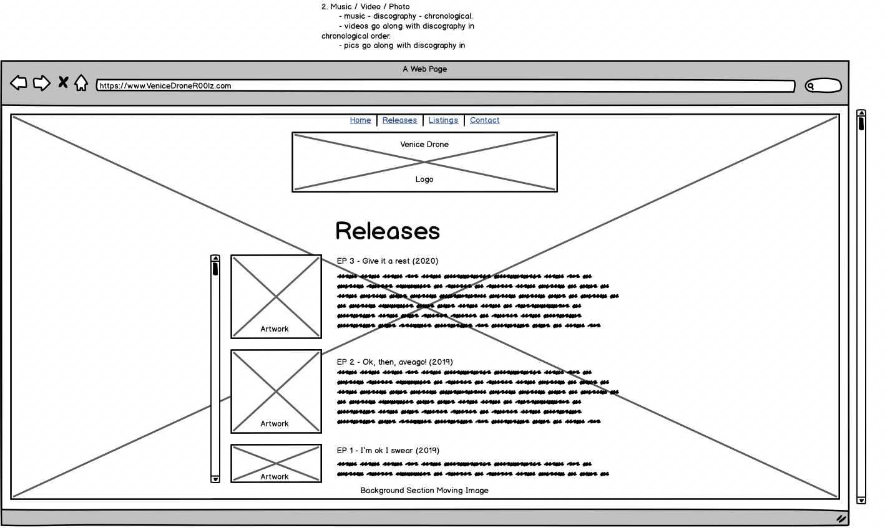
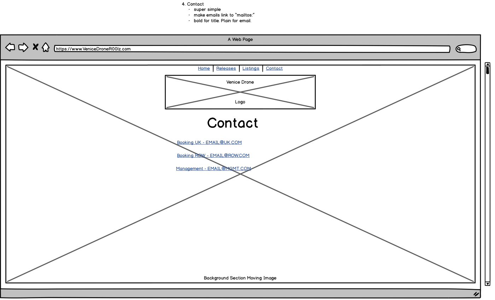
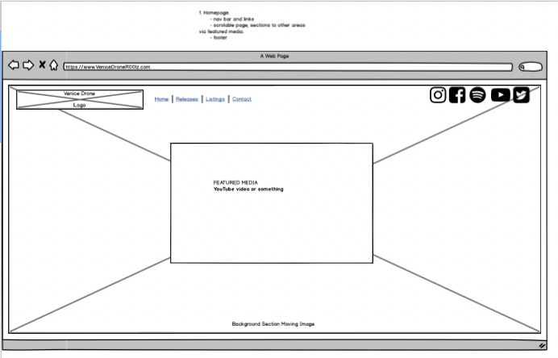
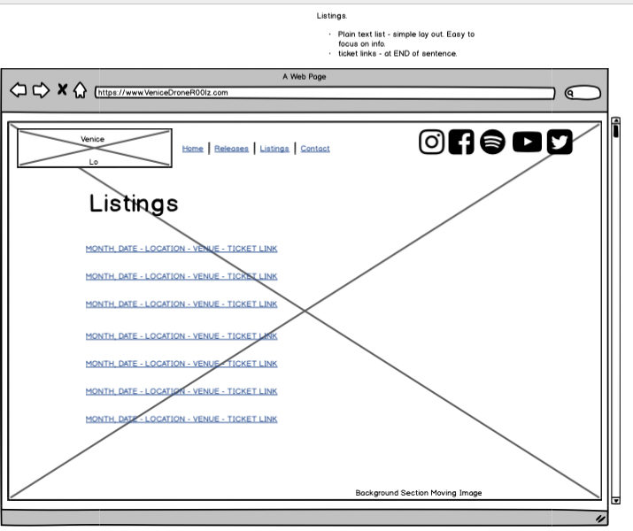

# Venice Drone Fan Website

This is the first assignement of the Full Stack Development course with Code Institute. This web site will showcase an understanding of HTML5 and CSS3 along with Bootstrap 4.5 in a user-facing static webfront for a rock band called Venice Drone.

This site will showcase the latest releases, make an archive of releases available to click to, let users see upcoming gig dates with links to buy tickets and give a wealth of communication options depending on how, and in what capacity, they want to get intouch with the band.

## UX

### **Design Theory**

The user experience is focused site-wide. The Venice Drone fanbase have a wide age range, so this site must be useable by teens and adults. For that reason each content section is seperated by a title header in a bold colour with to-the-point titles, and nice spacious margins around the content that is in focus for that section, which changes depending on view height.  

I wanted to achieve a useable website, with a tone and copy that represented the bands precise and to-the-point nature. For this reason only the content that is new and being promoted is on the front page. And more content is under the nav bar sections on other pages. 

They are a secretive, non-ego driven band with very little desire to share personal stories and damage the music with their own images. For this reason a 'about me' section was omitted.

The site is designed to be easily modifiable, since Venice Drone are an active band, when more content is released, it can easily be added to the site, and copied to the front page for a feature.

-----------------------------

### **Reference and tone**

Other similar sites I referenced were *Radioheads* 'WASTE' site (<https://www.wasteheadquarters.com/>) and *Idles* website (<https://www.idlesband.com/>) Particlarly the titles, dimentions, simplicity and direct tone.

-----------------------------

### **Design Choices**

The main colour theme was around the title bar blue, which is a muted colour that the band uses for logos. I then picked the theme based on that colour, using Coolers (<https://coolors.co/>) and highlted a dull but contrasting red for highlighted notes.

Colour Palette

* 

`#6d95aa` - Muted Teal / Main Banner / Logo color
* 

`#b54c49` - Mute Red / Alert / Focus color
* 

`#bec1b9` - Off-Grey / background color
* 

`#eaebea` - Off-White text color
* 

`#161614` - Off-Black text color

Fonts
I used a sans-serif for the main font, the sharpness off DM Mono was what I settled on.

[Google Fonts DM Mono](https://fonts.google.com/specimen/DM+Mono "font link dm mono")

and a secondary font of Roboto.

[Google Fonts Roboto](https://fonts.google.com/specimen/Roboto?query=roboto "font link roboto")

-----------------------------

### _User Stories:_

* As a long time fan of the band, I want to see the latest content at first glance and feel up to date. 
* As a new and curious fan of the band, I want to click through quickly and get a feel for what Venice Drone are.
* As a club promoter, I want to get to the bands contact information as quickly as possible and contact them about a performance.
* As a music lover, I want to listen to the bands music on my chosen platform.

-----------------------------

### _Wireframes:_

The original wireframe showed a simpler concept of one page internally scrollable content. Bold moving .gif backgrounds, hovering nav bar and floating social icons.

However, this format proved to be too on the nose, too informal, and the function was lost to cramped smaller screen sizes, and it didn't translate very well to mobile. 

After some redeigning, version 2 wireframes emerged. 

Some features changed during the build, but the change from version 1 to version 2 proved to be a much more functional platform to build from.

## Features

### Home

The home page is designed to provide the most up to date news in three simple features. The most important features are *Latest Music*, *Latest Video* and *Next Gig*.

### Releases

The releases page is designed to, once again, show the most recent and relevant release at the top and beneath it, the discography, in chronological order. 

### Gigs

Gigs page has a direct information table, venue, ticket link to buy tickets and all in date order. 

### Contact

Contact page, again, focuses on what is important to the user. Firstly, mailing list to keep up to date. Simple input box with some on-brand humour beneath it. Beneath that is the various social network and external content links under another on brand sarcastic banner, and beneath that is the least used, necessary, but not fan focused promoter and managerial contacts.

### Features Left to Implement

* Features that I plan to integrate are a media player on the releases page, playlist maker, and social media live stream ticker section.

## Technologies Used

As per the requirements of the assignements, the technologies used in this site are **[HTML5](https://w3.org/html)** and **[CSS](https://w3.org/css)**. Any additional technology is provided by included **[Bootstrap](https://getbootstrap.com)** scripts.

### Tools Used

* [Visual Studio Code](https://code.visualstudio.com/) -  The project used the **Visual Studio** IDE to develop the website linked with **Github** for version control.
* [Bootstrap 4.5](https://getbootstrap.com/) -  The project used the **Bootstrap 4.5** for a responsive grid system.
* [Font Awesome 5](https://fontawesome.com/) - The project used the **Font Awesome 5** for a icons throughout the site.
* [HTML Validator](https://validator.w3.org/) - The project used the **HTML Validator** to validate and find errors in the HTML.
* [CSS Validator](https://jigsaw.w3.org/css-validator/) -The project used the **CSS Validator** to validate and find errors in the CSS.
* [Balsamiq](https://balsamiq.com) https://balsamiq.com) -The project used the **Balsamiq** to generate wireframes for the site.

## Testing

I've been testing the site with the band themselves and with their sposes and partners. Focusing on features that they deemed necessary. The final version and the final wireframe shows the journey through testing to release. The Logo in the nav bar prooved too distracting first, followed by the .gif background idea.

I used VS Code Extentions to preview the site in different browsers, via Chrome. Extensively testing the layout changes at all media breakpoints. This process was made easier with **Bootstrap**. 

There is one layout issue that is really annoying me in the medium break point where the media boxes align the album artwork and the text left to the box, leaving a lot of wasted space on the right of the box. 

## Deployment

This section should describe the process you went through to deploy the project to a hosting platform (e.g. GitHub Pages or Heroku).

In particular, you should provide all details of the differences between the deployed version and the development version, if any, including:

* Different values for environment variables (Heroku Config Vars)?
* Different configuration files?
* Separate git branch?

In addition, if it is not obvious, you should also describe how to run your code locally.

## Credits

### Content

* The copy used for the _make contact_ section was copied and heavily edited for privacy from the [Idles Press & Bookings](https://www.idlesband.com/press-bookings/) page.

### Media

* The photos used in this site for the background were obtained from [Pexels](www.Pexels.com).

### Acknowledgements

* I received inspiration for this project from X
